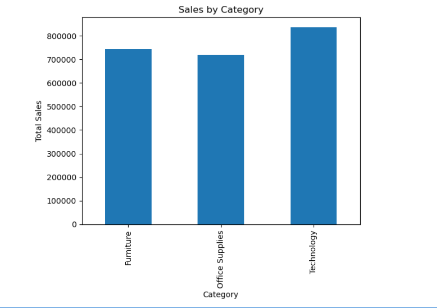
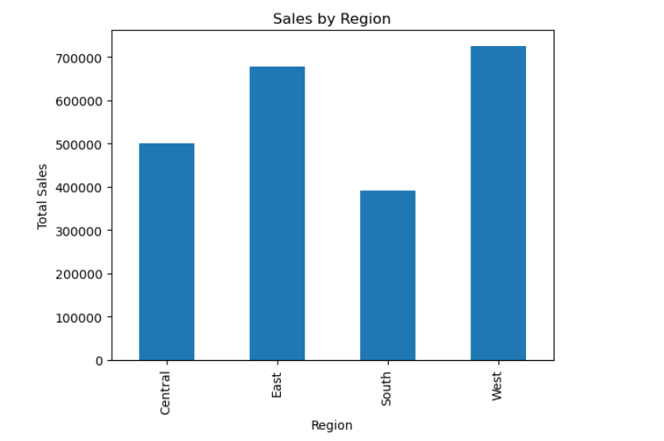
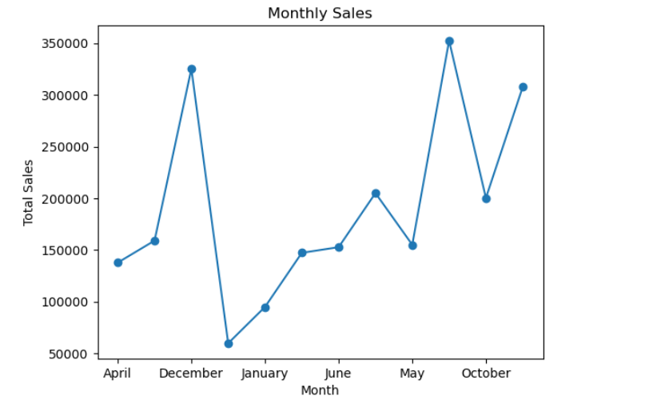
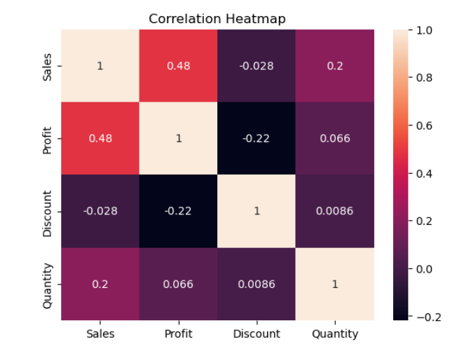
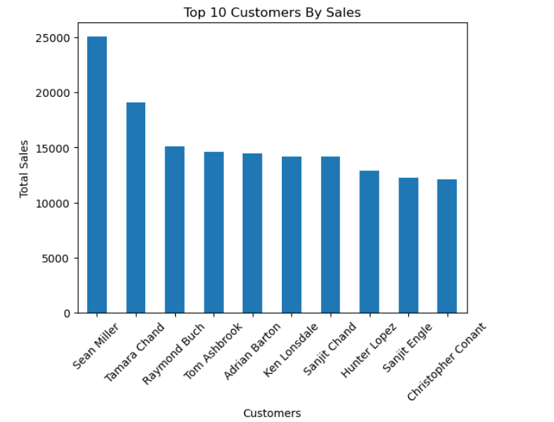

# E-Commerce Sales Analysis Project

## Project Overview

This project analyzes an e-commerce sales dataset using Python, Pandas, NumPy, Matplotlib, and Seaborn.

The goal of this project is to discover sales trends, profit patterns, customer behavior, and business insights through data analysis and visualization.

---

## Tools & Libraries Used

- Python
- Pandas
- NumPy
- Matplotlib
- Seaborn
- Jupyter Notebook

---

## Analysis Performed

- Data Cleaning
- Null Value Checking
- Duplicate Checking
- Sales Analysis
- Profit Analysis
- Region-wise Analysis
- Customer Analysis
- Monthly Sales Trend Analysis
- Correlation Analysis
- Heatmap Visualization

---

## Key Business Insights

1. Technology category generated the highest sales.

2. West region achieved the highest sales performance.

3. Discounts negatively impacted profit.

4. Certain customers contributed significantly higher revenue.

5. Sales and Profit showed moderate positive correlation.

---

## Project Visualizations

### Sales by Category

### Sales by Region

### Monthly Sales Trend

### Correlation Heatmap

### Top 10 Customers by Sales

---

## Future Improvements

- Build interactive Power BI dashboard
- Add SQL-based business queries
- Create advanced visual dashboards
- Perform predictive analytics

---

## Author

Roshan Praneeth
